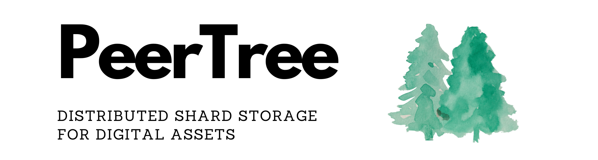

# The PeerTree Project

## An open source self-organizing peer-to-peer shard storage solution for digital assets

# Table of Contents

- [The PeerTree Project](#the-peertree-project)
  - [An open source self-organizing peer-to-peer shard storage solution for digital assets](#an-open-source-self-organizing-peer-to-peer-shard-storage-solution-for-digital-assets)
- [Table of Contents](#table-of-contents)

A self-organizing peer-to-peer network where peers can send and receive and broadcast JSON messages using HTTPS: using only self-signed certs. Messages are digitally signed by each node using EC private-public key pairs.

In the context of the PeerTree project, an *"EC private-public key pair"* refers to an encryption method called "elliptic curve cryptography." Elliptic curve cryptography (ECC) is a public key cryptography method that uses the properties of elliptic curves over finite fields to create a set of security keys.
In ECC, each user has a *private* key and a *public* key. The private key is a secret value known only to the user and is used to create digital signatures. The public key is a value that is shared with others and is used to verify the user's digital signature.
In the PeerTree project, the EC private-public key pair is used to digitally sign messages that are sent between nodes in the network. This helps to ensure the authenticity and integrity of the messages and allows nodes to verify that they are receiving messages from trusted sources.

The peers form a tree structure where new nodes are added from left to right. The first node is the root of a tree. Each node keeps a list of the root peer group and its own peer group. Nodes that leave or time out are replaced by the last node to join. Messages that can not be sent are pushed onto a queue and are delivered as soon as the connection returns or the node is replaced.

To read the detailed whitepaper see [this link](whitepaper.md)

The project also includes a proof-of-concept blockchain application that runs on top of the PeerTree object. We include a working demo of the project [here](https://www.bitmonky.com/whzon/bitMiner/webConsole.php?git=git).

If you would like to support the project financially, consider
purchasing some coins from our coin store by clicking the link(s) below!

https://bitmonky.com/whzon/wzApp.php?furl=https://www.bitmonky.com/whzon/gold/mrkViewGJEX.php

