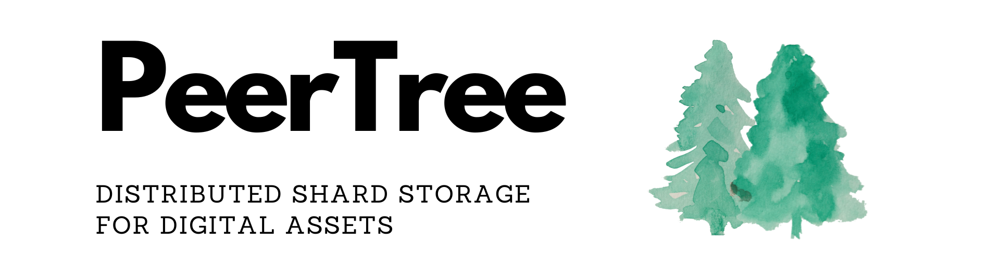
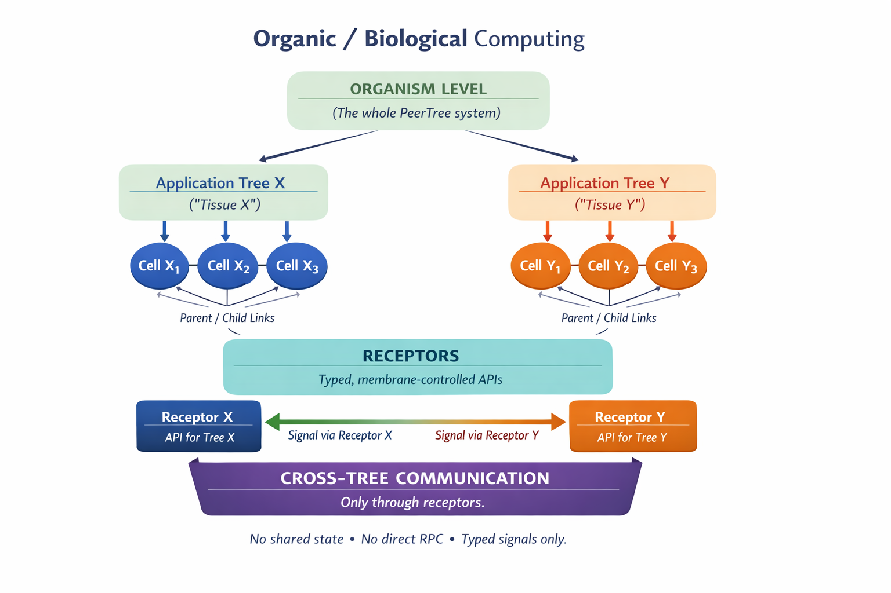

# The PeerTree Project

## A Biological Model For Computation 

Self‑organizing peer‑to‑peer cells that form specialized functional organisms, scaling by cloning cell types to increase collective computing power. 
Each cell type is identical to its peers and can instantly assume the role of any other cell in its tree, enabling seamless adaptation, redundancy, 
and self‑healing across the organism.

---

## Cell Application Specialization and Cloning

Each application in PeerTree exists as a specialized cell type, with every cell running the same organs, membrane rules, and receptor APIs. When the organism needs more capacity, resilience, or throughput, it simply clones additional cells of that type, allowing the Tree to grow organically. Because all clones are genetically identical, any cell can instantly perform any role within its Tree — processing requests, storing shards, routing messages, or coordinating state. This specialization‑through‑cloning model creates true application‑level services: distributed tissues of identical cells that scale, heal, and adapt automatically as the organism evolves.

## No‑Files Storage: Redundant Shards Of Data Randomly Distributed on Mulitiple Devices.

In this model, files don’t exist as monolithic objects. Instead, data is broken into fixed‑size shards, each identified solely by the SHA‑256 hash of its own contents. These shards are stored across the network by shardTreeCells, which replicate and distribute them like fragments of digital DNA. No filenames, no paths, no directories — only content‑addressed fragments. A separate class of cells, ftreeFileMgrCells, maintains lightweight hash‑maps that describe how to reassemble a file from its shards when needed. This separation of storage (shards) and structure (hash‑maps) creates a resilient, redundant, self‑healing storage organism where data persists as long as any quorum of shards survives.

## Cell Receptor API Access

Every cell type exposes an identical receptor API, giving the organism a uniform interface regardless of which physical node receives the request. Because all cells of a given type share the same genome, organ set, and receptor definitions, any cell can service any request at any time. Clients and other Trees don’t need to know which node they’re talking to — they simply signal the receptor, and whichever cell receives it can instantly take on the required role. This creates a fully distributed, load‑balanced, self‑healing service layer where capacity scales organically as new clones join the Tree.

---

## PeerTree.js — The Core Network Object That All Cells Inherit

A self‑organizing peer‑to‑peer network where nodes send, receive, and broadcast JSON messages over HTTPS using only self‑signed certificates. Every message is digitally signed with each node’s EC private–public key pair, ensuring identity, integrity, and tamper‑resistance. The network continuously repairs itself: nodes automatically rejoin, rebalance, and re‑establish parent/child links when peers appear, disappear, or restart. This creates a resilient, self‑healing communication fabric where trust emerges from cryptographic signatures and behavior, not central authorities.

## EC Private-Public Key Pairs
In the context of the PeerTree project, an *"EC private-public key pair"* refers to an encryption method called "elliptic curve cryptography." Elliptic curve cryptography (ECC) is a public key cryptography method that uses the properties of elliptic curves over finite fields to create a set of security keys.
In ECC, each user has a *private* key and a *public* key. The private key is a secret value known only to the user and is used to create digital signatures. The public key is a value that is shared with others and is used to verify the user's digital signature.

## Digital Signatures
In the PeerTree project, the EC private-public key pair is used to digitally sign messages that are sent between nodes in the network. This helps to ensure the authenticity and integrity of the messages and allows nodes to verify that they are receiving messages from trusted sources.

The peers form a tree structure where new nodes are added from left to right. The first node is the root of a tree. Each node keeps a list of the root peer group and its own peer group. Nodes that leave or time out are replaced by the last node to join. Messages that can not be sent are pushed onto a queue and are delivered as soon as the connection returns or the node is replaced.

## PeerTree Whitepaper
To read the detailed whitepaper see [this link](whitepaperNew.md)

Think PeerTree is cool?  See The BorgIOS Project [this link](https://github.com/bitmonky/BorgIOS) Shows what can be done with peerTree's

Currently we are working on the cloud memory peerTree application. We include a working demo of the project [here](https://www.bitmonky.com/whzon/bitMiner/webConsole.php?git=git).

The project also includes a proof-of-concept blockchain application that runs on top of the PeerTree object.  

If you would like to support the project financially, consider
purchasing some coins from Peter's coin store by clicking the link(s) below!

